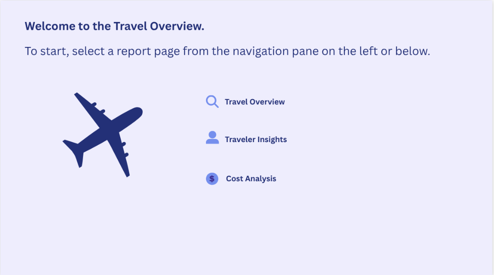
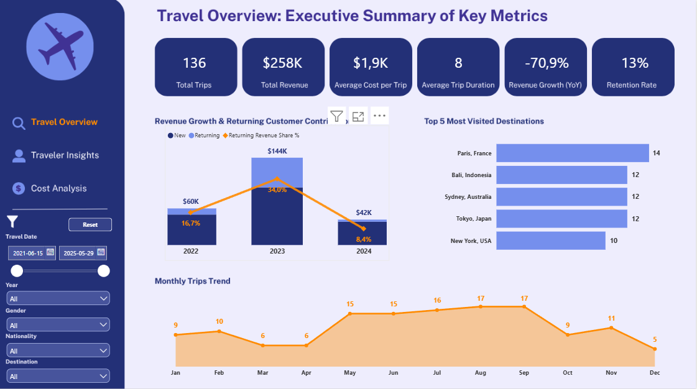
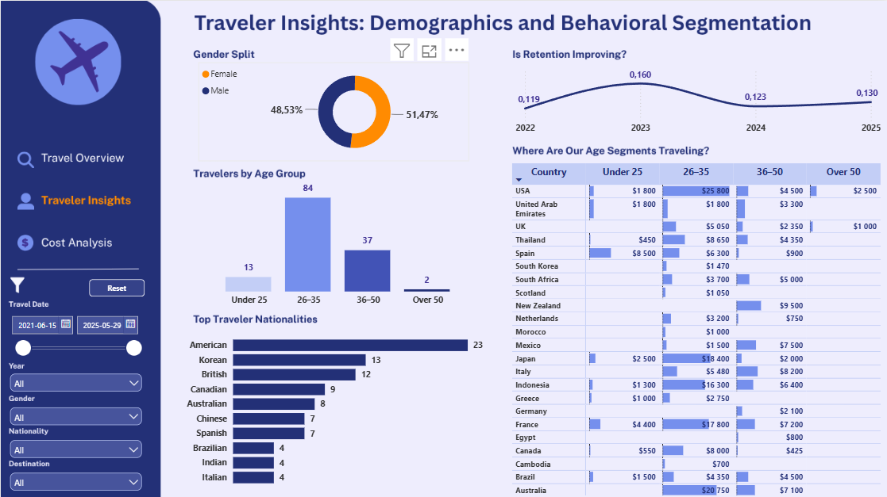
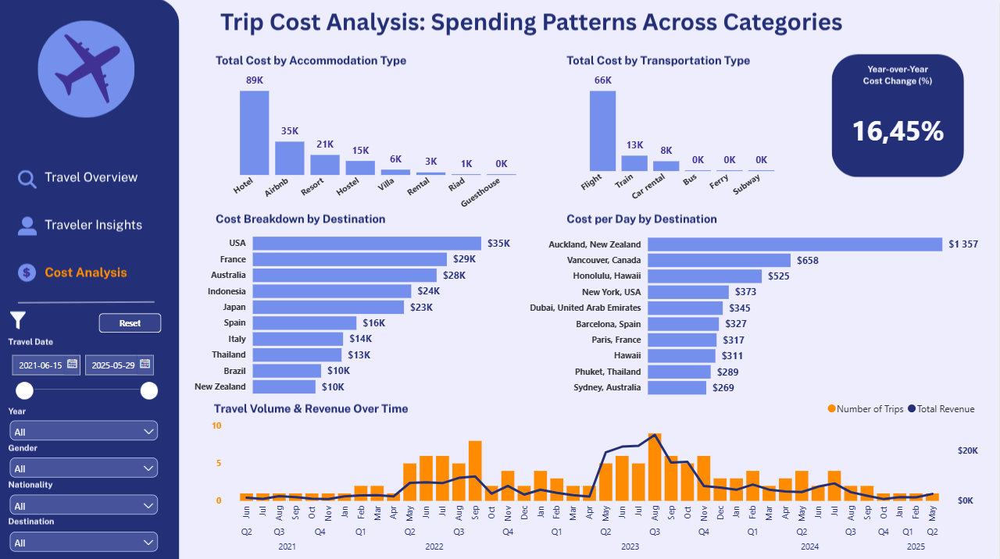
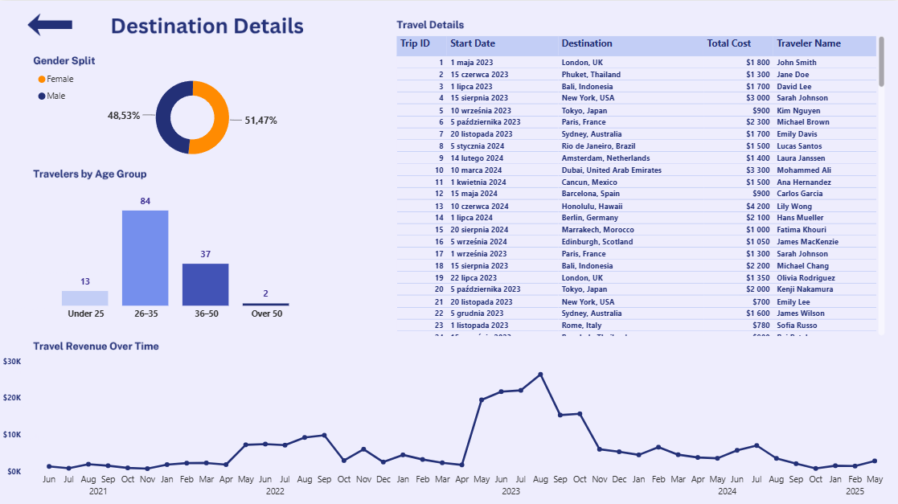
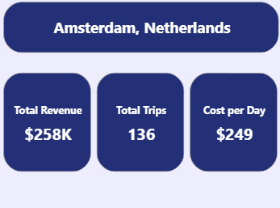

# TravelHub — Growth & Retention Analytics Dashboard

Power BI dashboard analyzing four years of booking data (2021–2025) for a fictional OTA (Online Travel Agency), built to help commercial leadership understand what is driving revenue growth, who the customers are, and where cost and retention risk sit in the business.


---

## Business Problem

TravelHub has four years of transactional booking data, but leadership has no visibility into **what is actually driving revenue growth** — new customer acquisition or repeat business — nor where the business is exposed to risk (declining retention, cost concentration in a small number of destinations, under-prepared seasonal capacity).

## Goal

Build a self-serve dashboard for the **Head of Growth / Commercial Director** that answers three decision-level questions:

1. Is growth coming from **new customer acquisition or retention** — and which should we invest in?
2. Which **destinations and segments** are driving growth, and which are flat or declining?
3. Where is **seasonality and cost concentration risk**, and does it need an operational response?

These sit on top of five underlying analytical questions the dashboard was scoped around: total revenue/trips over time, customer demographics, revenue/cost by destination, cost by accommodation and transportation type, and customer retention.

## Data

136 bookings, 16 fields (destination, dates, duration, traveler demographics, accommodation, transportation, cost), sourced as a public Kaggle travel-details dataset and treated as TravelHub's internal booking export for this project. Original file had locale-specific dates (Polish month abbreviations) and semicolon delimiters — a deliberate choice to practice real-world import issues rather than working from a pre-cleaned CSV.

## Data Model

Star-schema style: one fact table (`Travel details dataset`) related to a `DateTable` (1-to-many, active relationship, marked as a Date Table) on `Start Date`, enabling native time-intelligence functions (`SAMEPERIODLASTYEAR`, `DATESINPERIOD`, `REMOVEFILTERS`-based cumulative calculations).

`Destination` was split into `City` and `Country` dimensions (standard dimensional-modeling practice, supports both chart labels and country-level roll-ups/future drill hierarchies) while the original combined field was kept for filters and tooltips.

## Data Quality Control & Preparation

The raw import required substantial cleaning before any measure could be trusted. Highlights:

| Issue | Impact | Fix |
|---|---|---|
| Dates stored as text with Polish month abbreviations (`01-maj-23`) | No date filtering, no time intelligence possible | Explicit `Using Locale → Polish (Poland)` in Power Query, independent of the machine's OS locale |
| Transportation Type recorded as `Plane`/`Flight`/`Airplane`/`Car`/`Car rental` — the same categories spelled five different ways | Chart would show flights as a minor category instead of ~55% of all trips | Consolidated via Replace Values with **Match entire cell contents** (a looser match causes cascading bugs, e.g. `Bali` → `Bali, Indonesia` silently becoming `Bali, Indonesia, Indonesia`) |
| `Destination` had 71 raw values representing far fewer real places (`Tokyo` / `Tokyo, Japan`, `Bangkok, Thai` / `Bangkok`) | Revenue-by-destination and Top destinations charts fragmented into false duplicates | ~20 targeted Replace Values passes → 38 clean, de-duplicated destinations |
| 12 records had only a country, no city (e.g. `Greece`) | Risk of fabricating a city that isn't in the source data | **Deliberately not guessed.** Flagged with a `Location Granularity` column so city-level visuals can safely exclude them without losing the revenue from the overall totals |
| `Hawaii` appeared as both a standalone value and part of `Honolulu, Hawaii` | Hawaii is a US state, not a country — would appear as a false "country" on a revenue-by-country view | Corrected to `USA` based on geographic fact, not assumption |
| Cost columns imported ambiguously, wrapped in `VALUE()` inside every measure | Unnecessary row-by-row type conversion on every refresh | Explicit Decimal Number typing set once in Power Query; measures simplified to plain `SUM()` |

Full before/after log (14 documented issues) available in the repo.

## Report Pages & UX Navigation

### Main Views

**0. Landing Page** — Central navigation hub providing clean entry points to all report pages and key executive metrics.


**1. Growth Overview** — Is the business growing, and how? Revenue, trips, YoY growth (full years only) and retention rate at a glance, a 12-month seasonality view, and a New-vs-Returning revenue split by year.


**2. Traveler Insights** — Who are the customers, and are they coming back? Gender, age and nationality segmentation, a Country × Age Group matrix, and a cumulative retention-rate trend.


**3. Cost & Risk Analysis** — Where is the money going, and where's the risk? Cost by accommodation and transportation type, cost-by-destination vs. cost-per-day, and volume/revenue over time.


## Interactive Features & UX Design

* **Destination Details (Drill-Through Page):** Contextual deep-dive page accessible by right-clicking any specific destination across the report. Filters all visuals (demographics, revenue over time, and full trip logs) specifically for the selected city.


* **Custom Destination Tooltip:** Custom hover tooltip displaying context-specific metrics (breakdown of new vs. returning revenue and total trip counts) without cluttering the main canvas.


## Technical Highlights

**Catching a filter-context bug in a cumulative DAX measure.** An early version of the retention-rate-over-time measure produced a count of distinct travelers that *decreased* year over year — impossible for a genuinely cumulative metric. The cause: the active `DateTable ↔ Start Date` relationship was silently filtering the fact table to a single year before the measure's own `<= MAX(Date)` condition could apply, so the condition never actually extended the window. Fixed by capturing the date boundary in a variable first, then explicitly clearing the year filter with `REMOVEFILTERS('DateTable')` before re-applying the date condition:

```dax
Retention Rate Cumulative =
VAR MaxDate = MAX('DateTable'[Date])
VAR TravelersToDate =
    CALCULATETABLE(
        VALUES('Travel details dataset'[Traveler Name]),
        REMOVEFILTERS('DateTable'),
        'Travel details dataset'[Start Date] <= MaxDate
    )
VAR RepeatToDate =
    FILTER(
        TravelersToDate,
        CALCULATE(
            DISTINCTCOUNT('Travel details dataset'[Trip ID]),
            REMOVEFILTERS('DateTable'),
            'Travel details dataset'[Start Date] <= MaxDate
        ) > 1
    )
RETURN DIVIDE(COUNTROWS(RepeatToDate), COUNTROWS(TravelersToDate))
```

This also changed the business conclusion: the broken version suggested retention was steadily declining; the corrected version shows it **fluctuating between 12–16%**, a materially different (and more defensible) story for a stakeholder deck.

**A second, related pitfall: `SAMEPERIODLASTYEAR` combined with a multi-year filter.** The YoY growth KPI used a standard time-intelligence pattern (`SAMEPERIODLASTYEAR` to fetch prior-year revenue) alongside an `Is Full Year` visual filter excluding partial years. In isolation, each was correct — together, they weren't: `Is Full Year` filtered the date context to three years at once (2022–2024), so `SAMEPERIODLASTYEAR` shifted that entire three-year block back by one year instead of shifting a single year, producing a blended comparison between two overlapping multi-year windows. It happened to return a plausible-looking +16.5%, which went unchallenged until the underlying yearly figures ($60K → $144K → $42K) were checked against it directly and didn't reconcile. The fix was to stop relying on ambient filter context altogether and make the measure self-contained:

```dax
Revenue Growth YoY (Full Years) =
VAR LatestFullYear =
    CALCULATE(MAX('DateTable'[Year]), FILTER(ALL('DateTable'), 'DateTable'[Is Full Year] = TRUE))
VAR CurrentYearRevenue =
    CALCULATE([Total Revenue], FILTER(ALL('DateTable'), 'DateTable'[Year] = LatestFullYear))
VAR PrevYearRevenue =
    CALCULATE([Total Revenue], FILTER(ALL('DateTable'), 'DateTable'[Year] = LatestFullYear - 1))
RETURN
    DIVIDE(CurrentYearRevenue - PrevYearRevenue, PrevYearRevenue, 0)
```

The real number is **-70.9%** (2024 vs. 2023) — a materially different, and far more useful, finding than the one it replaced.

**Recognizing when a measure doesn't belong on a chart.** A 3-month rolling average was originally added to the "Monthly Trips" chart — until testing showed the chart's x-axis was month *name* aggregated across all five years (a seasonality view), not a continuous timeline, so a rolling average over it was mathematically meaningless. Rather than leave a measure that silently computed the wrong thing, it was moved to the one chart with an actual chronological axis (quarterly volume/revenue on the Cost Analysis page), and the seasonality chart was left as a single, correctly-scoped metric.

**Segmenting revenue by customer type with row-context logic:**

```dax
Traveler Segment =
VAR FirstTripDate =
    CALCULATE(
        MIN('Travel details dataset'[Start Date]),
        ALLEXCEPT('Travel details dataset', 'Travel details dataset'[Traveler Name])
    )
RETURN IF('Travel details dataset'[Start Date] = FirstTripDate, "New", "Returning")
```

## Key Findings

- **$258K** total revenue across **136** bookings (2021–2025); average cost per trip **$1.9K**.
- Revenue **declined 70.9% year-over-year** in the most recent full year (2024 vs. 2023). 2023 was an exceptional peak ($144K), roughly 2.4x both the year before and the year after — the business has not yet repeated that performance, and 2024 landed closer to 2022's baseline than to 2023's. Worth noting: the dataset's small size (136 bookings across 4 years) means a handful of large bookings can swing an annual total substantially — this should be investigated against real transaction-level detail before treating 2023 as the "new normal" or 2024 as a genuine downturn.
- The share of revenue from **returning customers rose from 16.7% (2022) to 34.0% (2023)**, then fell back to 8.4% in 2024 — growth has not consistently shifted toward a loyal customer base.
- Retention fluctuates between **12% and 16%** year over year rather than trending in a single direction.
- **Flight is the dominant transportation cost** ($66K) once the three overlapping category labels were merged — originally invisible in the raw data.
- **Hotel** is the leading accommodation cost category, more than double the next largest (Airbnb).
- Clear **June–September seasonal peak** in trip volume.
- Top five destinations by volume: Paris, Bali, Sydney, Tokyo, New York.
- One destination (Auckland) shows a cost-per-day far above all others — traced to a single low-sample booking rather than a genuine pricing pattern, and flagged rather than smoothed over.

## Conclusions & Recommendations

- **2023's peak needs explaining before it's relied on.** A -70.9% swing the following year is too large to plan around without understanding its driver (one-off large accounts? a marketing campaign? seasonality overlap?) — recommend a follow-up analysis at the individual-booking level rather than treating the aggregate trend as self-explanatory.
- **Retention is inconsistent, not healthy** — the New vs Returning split shows no sustained upward trend. Recommend a loyalty/retention initiative rather than assuming organic improvement.
- **Cost structure is concentrated**: Flight and Hotel dominate spend. Worth renegotiating with top transportation/accommodation partners before diversifying the portfolio.
- **Seasonal capacity planning** should anchor on the June–September peak, which is consistent across years in this dataset.
- Single-booking destinations (like Auckland) should be **excluded from pricing-strategy decisions** until more data accumulates — a good example of a metric that is correct but not yet decision-ready.

## Assumptions & Limitations

- 2021 (from June) and 2025 (through May) are partial years; excluded from all year-over-year comparisons via an `Is Full Year` flag, but still included in lifetime totals.
- 12 bookings with only a country recorded (no city) are intentionally not matched to a guessed city — they're included in country-level and revenue totals, excluded from city-level views via a `Location Granularity` flag.
- Decimal separator in a handful of visuals displays with a comma rather than a period due to the Power BI data model's culture setting, which is not user-editable from the report itself without external tooling (e.g. Tabular Editor) — resolved only where it affected a primary KPI, documented here rather than hidden.
- Sample size (136 bookings) is small for some cuts (e.g. per-destination cost-per-day); findings at that granularity are directional, not statistically robust.

## Further Development

- Field Parameters to let the viewer toggle "Top destinations by trips" vs. "by revenue" on one visual instead of two.
- A drillthrough page per destination with full trip-level detail.
- Extending the model with a proper calendar-based cohort retention analysis once more historical data is available.
- Connecting to a live booking source instead of a static CSV export.

## What I Learned

This project started from an AI-generated first draft with syntactically valid but logically fragile DAX (redundant type conversions, a filter-context bug that silently broke a core metric, a measure applied to a chart where it didn't make mathematical sense). Rebuilding it meant learning to interrogate *why* a result looked right, not just that it rendered without error — particularly the difference between a measure that is syntactically correct and one that is contextually correct within Power BI's filter propagation model. The retention-rate bug specifically was a turning point: tracing a monotonically-decreasing "cumulative" metric back to `REMOVEFILTERS` taught me more about DAX filter context than any tutorial had.

## Tools Used

Power BI Desktop · DAX · Power Query (M) · Canva (visual design)

## Author

**Monika Monczak** — Data Analyst, learning in public
[LinkedIn](https://www.linkedin.com/in/monika-monczak-76481315b/) · [Email](mailto:monikab.monczak@gmail.com)
